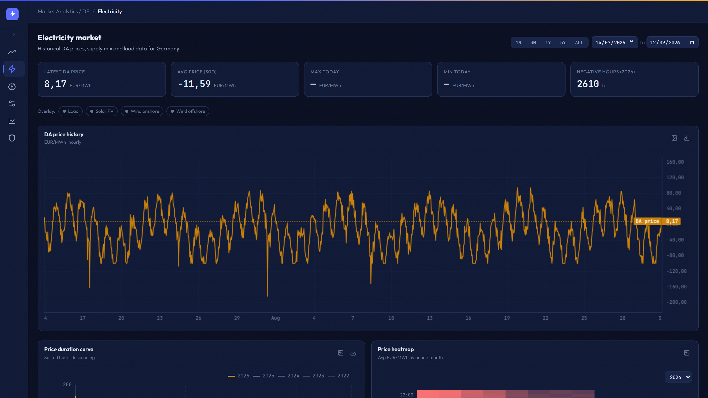
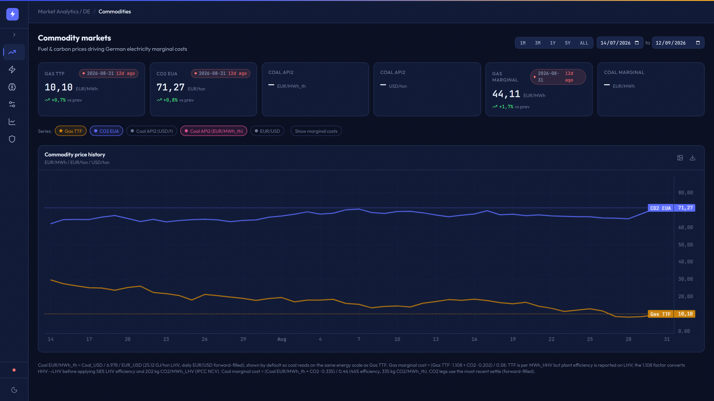
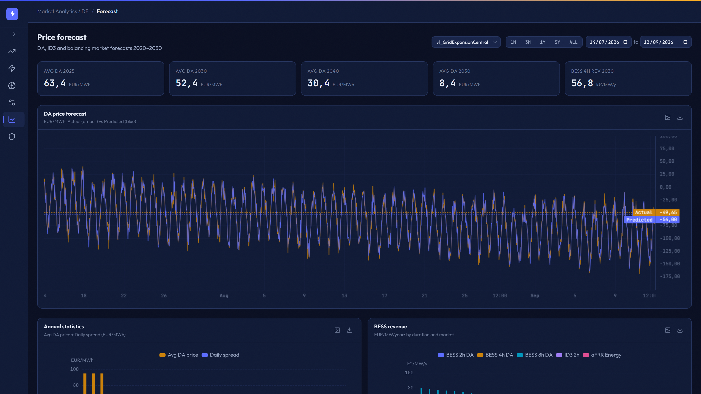
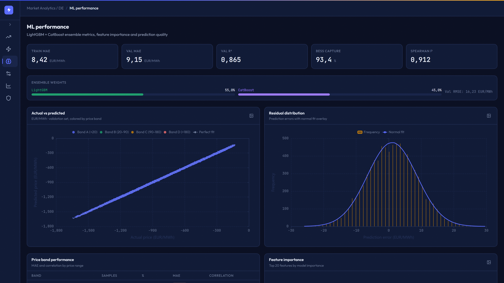
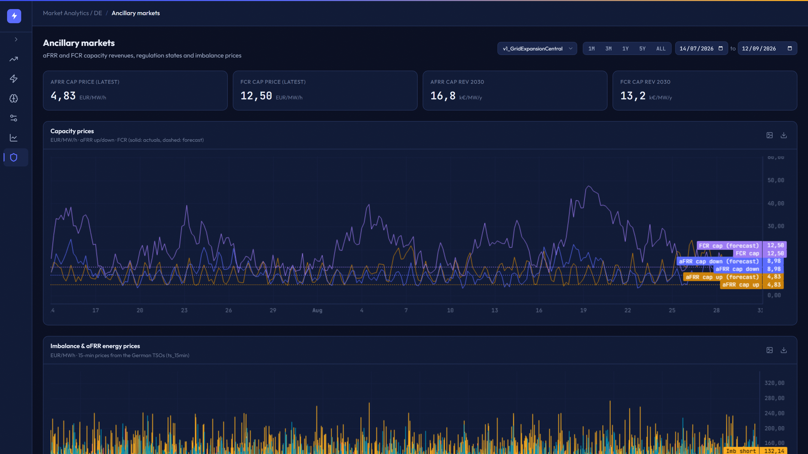
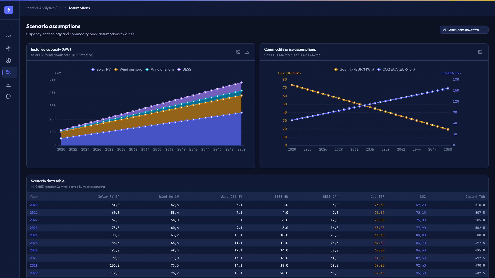

# Overview

Interactive dashboard for **German electricity market** data, with clearly-labelled synthetic demo data out of the box.

A six-page web app for exploring the German power market: day-ahead prices, load/renewables/cross-border flows, commodity-driven marginal costs, DA/ID3 forecasts, ML model diagnostics, ancillary-services capacity and revenue, and scenario assumptions out to 2050 — all backed by a DuckDB engine.

> 🎬 **Video tour:** [watch hero-tour.webm](screenshots/hero-tour.webm) (2.9 s, all six pages) — or clone the repo and run it locally to click through for real.

!!! quote "Why it exists"
    Energy analysts need to see the data, the forecast, and the model's behavior in one place — not a Jupyter notebook, not a static PDF. This dashboard is a self-contained analytics surface for the German market (EPEX DE/AT/LU day-ahead zone; TSOs 50Hertz, Amprion, TenneT DE, TransnetBW).

## Highlights

- **Native DuckDB query engine** — wide-format columnar reads in milliseconds, no ORM, no Python pivot loops
- **Async FastAPI handlers** with threadpool offload for blocking file I/O, and HTTP `Cache-Control` for immutable historical ranges
- **React 19 + TanStack Query + Vite** frontend; ECharts for analytics, TradingView lightweight-charts for time series
- **Server-side LTTB downsampling** caps every chart payload to a few thousand points without losing extremes
- **Two data modes, one API** — demo mode (synthetic, no data required) and live mode (bring-your-own DuckDB + model artifacts)
- **32 tests** run in CI against the generated demo data; no proprietary market data is committed

## Pages

### Commodities — TTF gas & EUA CO₂

Gas TTF, CO₂ EUA, Coal API2 and EUR/USD with KPI cards and 30-day deltas — toggle the **Marginal Costs** overlay to see how fuel + carbon translate into the cost of the next MWh on the German grid (CCGT @ 58% LHV incl. HHV→LHV, coal @ 46%).

### Electricity — supply, demand & cross-border flows

Day-ahead price history with optional load / PV / wind on/offshore overlays, plus per-year price-duration curves (with negative-hours count) and an hour-×-month heatmap that shows where on the calendar the cashflow actually lives.

### Forecast — day-ahead & intra-day price predictions

Demo forecast vs realised DA prices for the selected scenario, with annual avg/spread bars and BESS revenue per duration class (2h / 4h / 8h DA, ID3 2h, aFRR Energy) in k€/MW/year.

### ML — model diagnostics & feature importance

Ensemble metrics (MAE / R² / RMSE / Spearman, BESS capture rate), actual-vs-predicted scatter coloured by price band, residual histogram, top-20 feature importances and per-band MAE table.

### Ancillary — FCR / aFRR capacity & regulation states

aFRR Up/Down and FCR capacity-price time-series, an annual revenue stack (aFRR cap + FCR cap + aFRR energy) per scenario year, and a regulation-state donut for the German balancing market.

### Scenarios — assumptions out to 2050

The assumptions feeding the forecast: stacked installed-capacity area (PV / wind on / wind off / BESS), dual-axis Gas TTF and CO₂ EUA price paths, and a year-by-year assumption table exportable to CSV.